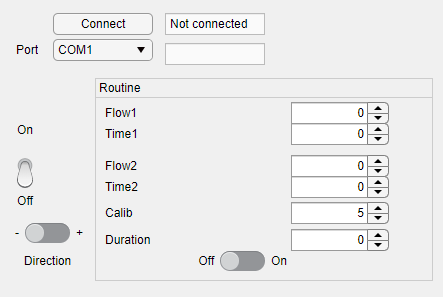

Very simple software to control an ISMATEC pump to make it switch between two flowrates.

To use it:
Simply launch the .mlapp on MATLAB and follow the GUI.

Flow1: flow rate (arbitrary unit) lasting Time1 (seconds)
Flow2: flow rate (arbitrary unit) lasting Time2 (seconds)

Flow1 and Flow2 are alternating until time=Duration is reached.
Calib depends on the pump and must be set so that Flow1 is equal to the actual flow rate.

More complex patterns coming soon.
